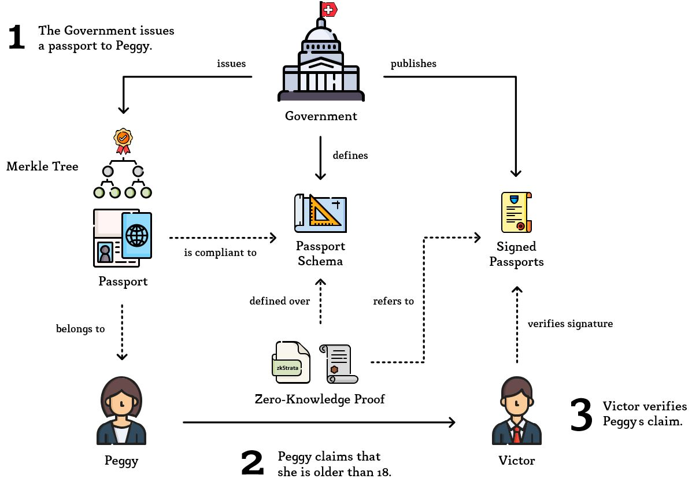

# Example: Passport
[](https://github.com/MarcKloter/zkStrata/actions?query=workflow:"example:+passport")

This example showcases how zkStrata can be utilized by a Prover _Peggy_ to convince a Verifier _Victor_ that she is older than 18 years, based on a government-issued passport, without having to show him the passport nor expose any information beyond the fact that her statement is true.  

## Overview
1) The swiss **Government**: 
   - Defines the structure of a swiss passport as `passport_ch` and publishes this **Passport Schema** as [JSON Schema](https://json-schema.org/) `passport_ch.schema.json`. 
   - Issues a **Passport** (that is compliant to `passport_ch`) to its citizen Peggy.
   - To mark the issued passport as authentic, it publishes the signature of the root hash of a merkle tree formed from the fields of Peggys passport on a tamper-evident channel (such as a blockchain) as part of all **Signed Passports**.
2) **Peggy**:
   - Writes her claim as statement in zkStrata referencing the root hash signed by the Government.
   - Compiles and executes this statement to generate a **Zero-Knowledge Proof**.
   - Sends this Zero-Knowledge Proof together with her statement to Victor.
3) **Victor**:
   - Compiles Peggys claim himself and verifies the given Zero-Knowledge Proof.
   - Verifies the root hashed used within the claim.
   - If both verifications were successful, Victor is convinced by Peggys statement through his trust in the swiss Government.


_Icons made by [Freepik](https://www.flaticon.com/authors/freepik) from [flaticon.com](https://www.flaticon.com)_

## Prerequisites
To run this example, you may wish to check that you have all [prerequisites](../) installed.

## Statement in zkStrata
For Peggy to prove her claim, she begins with writing her statement into a `.zkstrata` file. First, she declares all subjects that the statement will use. In this case this will be a `WITNESS` (confidential data) aliased as `myPassport` which is compliant to the `passport_ch` schema published by the Government (found in [passport_ch.schema.json](passport_ch.schema.json)). Then, she declares her claim as a concatenation of propositions, which express that the field `myPassport.dateOfBirth` is at least 18 years in the past. For simplicity, we will assume that today's date is **January 31, 2020** and that only the owner of a passport is able to construct a proof for such, whereby she only has to show, that the birthdate stated on the passport is on or before January 31, 2002. Dates within this example will be encoded as numerals in the format `yyyymmdd` (basic format of [ISO 8601](https://www.iso.org/iso-8601-date-and-time-format.html)).

Which results in the following statement ([passport-example.zkstrata](passport-example.zkstrata)):

```
PROOF FOR
    WITNESS myPassport COMPLIANT TO passport_ch
THAT
    myPassport.dateOfBirth <= 20020131
```

To associate the witness `myPassport` to the government-issued document, the corresponding _Validation Rule*_ - placed within the `passport_ch` (defined by the swiss Government) - is implicitly being added to the statement:

```
PROOF FOR 
    THIS 
THAT 
    public.rootHash_hex IS MERKLE ROOT OF 
    (
        (
            (private.firstName, private.lastName), 
            (private.dateOfBirth, private.placeOfOrigin)
        ),
        (
            (private.dateOfIssue, private.dateOfExpiry), 
            (private.authority, private.identifier)
        )
    )
AND
    private.dateOfExpiry > _CURRENT_DATE
```
_* Validation Rules are optional statements that can be appended to a schema. Whenever a subject is compliant to the given schema ("the schema is used") the compiler will implicitly add the predicates of this statement to the claim._

Using her government-issued passport (witness) [myPassport.json](myPassport.json), the schema [passport_ch.schema.json](passport_ch.schema.json) and the public root hash [myPassport.metadata.json](myPassport.metadata.json):

```
{
    "rootHash_hex": "0x06b131554e4e50b52e096971533411c7623504f6a56edf1bccdc810672efdd22"
}
```

Peggy can compile the [passport-example.zkstrata](passport-example.zkstrata),:

```
java -jar zkstratac.jar --statement     passport-example.zkstrata
                        --schema        passport_ch=passport_ch.schema.json
                        --witness-data  myPassport=myPassport.json
                        --instance-data myPassport=myPassport.metadata.json
```

_**Note:** Additionally to the Validation Rule defined in [passport_ch.schema.json](passport_ch.schema.json), there are also implicit bounds checks being added, as the JSON Schema defines `minimum` and `maximum` validation keywords for the date fields. This behavior can be observed by adding the `--verbose` flag to the compiler execution._ 

Which results in an intermediate representation that can be executed by a Zero-Knowledge Proof protocol. Currently, this is [bulletproofs_gadgets](https://github.com/MarcKloter/bulletproofs_gadgets), an extension of [Bulletproofs](https://crypto.stanford.edu/bulletproofs/) implemented by [dalek-cryptograph](https://github.com/dalek-cryptography/bulletproofs).

## Generating a Proof
Peggy generates a Zero-Knowledge Proof using the intermediate `passport-example.gadgets`, `passport-example.wtns` and `passport-example.inst` files:

Unix-based operating systems:
```
prover passport-example
```

Windows:
```
prover.exe passport-example
```

The binaries will construct a constraint system containing 43'178 constraints that will be used to generate a `passport-example.proof` (the Zero-Knowledge Proof) and `passport-example.coms` (witness commitments required by the Verifier) file. She then sends Victor her Zero-Knowledge Proof consisting of the following files:

| File | Size |
| ---- | ---- |
| `passport-example.zkstrata` | 104 bytes |
| `myPassport.metadata.json` | 94 bytes |
| `passport-example.coms` | 2'872 bytes |
| `passport-example.proof` | 1'377 bytes |
| **Total** | 4'447 bytes |

## Verifying a Proof
For Victor to verify Peggys statement, he queries the `passport_ch` schema from the swiss Government and compiles the `.zkstrata` claim himself:

```
java -jar zkstratac.jar --statement     passport-example.zkstrata
                        --schema        passport_ch=passport_ch.schema.json
                        --instance-data myPassport=myPassport.metadata.json
```

This creates the `passport-example.gadgets` and `passport-example.inst` files that can be used to verify Peggys Zero-Knowledge Proof contained in `passport-example.proof` and `passport-example.coms`:

Unix-based operating systems:
```
verifier passport-example
```

Windows:
```
verifier.exe passport-example
```

Which results in `true`, whereby Victor is convinced, that the date of the field `dateOfBirth` is in fact at least 18 years in the past and part of a document whose merkle root is `0x06b131554e4e50b52e096971533411c7623504f6a56edf1bccdc810672efdd22`. 

To check whether this document is actually a passport issued by the swiss Government, he queries the Signed Passports and checks the signatures for this root hash. To do this, he knows the public key of the swiss Government [public.pem](public.pem) and receives the signature of Peggys passport [signature.crt](signature.crt) that he verifies using:

```
openssl rsautl -verify -inkey public.pem -pubin -keyform PEM -in signature.crt
```

Which returns the signed message `0x06b131554e4e50b52e096971533411c7623504f6a56edf1bccdc810672efdd22` which finally convinces him, that Peggys government-issued passport states that her age is over 18 years.
