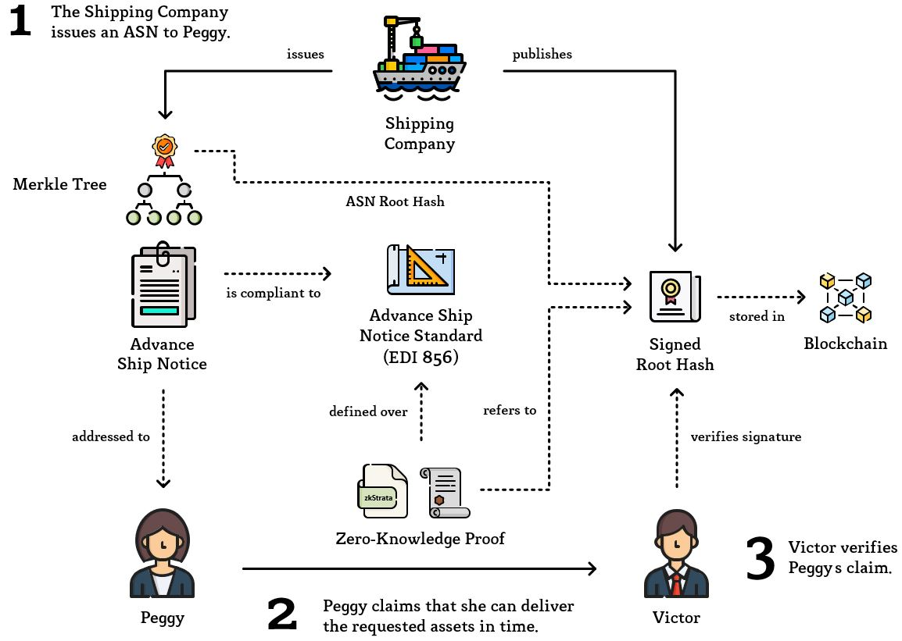

# Example: Shipment
[](https://github.com/MarcKloter/zkStrata/actions?query=workflow:"example:+shipment")

This example showcases how zkStrata can be utilized by a Prover _Peggy_ to solve the following problem: Peggy and her business partners are using a public blockchain to persist documents related to their supply chain. Due to the fact that the chosen storage medium is publicly available and their data is confidential, they use encryption to protect their business secrets. A potential customer _Victor_ urgently needs a large amount of fungible assets and is ready to pay a substantial bonus, if someone is able to deliver his desired goods in time. Peggy now wants to prove to Victor, that a carrier is currently delivering a shipment to Peggy, that will arrive in time and contains enough assets to fulfill Victors needs, without revealing her business secrets related to this shipment.

## Overview
1) The **Shipping Company**:
   - Issues an **Advance Ship Notice (ASN)** compliant to the ASC X12 **EDI 856 Standard** to confirm the shipment of Peggys order and stores its merkle root hash as **Signed Root Hash** within a blockchain to be held liable.
2) **Peggy**:
   - Writes her claim as statement in zkStrata referencing the root hash signed by the Shipping Company.
   - Compiles and executes this statement to generate a **Zero-Knowledge Proof**.
   - Sends this Zero-Knowledge Proof together with her statement to Victor.
3) **Victor**:
   - Compiles Peggys claim himself and verifies the given Zero-Knowledge Proof.
   - Verifies the root hashed used within the claim.
   - If both verifications were successful, Victor is convinced by Peggys statement through his trust in the swiss Government.


_Icons made by [Freepik](https://www.flaticon.com/authors/freepik) from [flaticon.com](https://www.flaticon.com)_

## Prerequisites
To run this example, you may wish to check that you have all [prerequisites](../) installed.

## Statement in zkStrata
For Peggy to prove her claim, she begins with writing a statement into a `.zkstrata` file. First, she declares all subjects that the statement will use. In this case this will be a `WITNESS` (confidential data) aliased as `asn` which is compliant to the `edi_856_asn` schema defined by the ASC X12 (a simplified version used within this example can be found in [edi_856_asn.schema.json](edi_856_asn.schema.json)). Then, she declares her claim as a concatenation of propositions expressing that the given ship notice confirms the timely arrival of the requested assets. For this we will assume that Victor is asking for 320 liters of a substance identified as `PT9KTBC5` to be delivered by January 31, 2020. To state a timely delivery, Peggy shows that the shipment confirmed by the shipping company will be delivered to her at least 3 days and no more than 10 days prior to Victors deadline.

Which Peggy expresses in the following statement ([shipment-example.zkstrata](shipment-example.zkstrata)):

```
PROOF FOR
    WITNESS asn COMPLIANT TO edi_856_asn
THAT
    asn.itemDetails.identification = 'PT9KTBC5'
AND
    asn.itemDetails.numberOfUnitsShipped >= 320
AND
    asn.itemDetails.unitOrBasisForMeasurementCode = 'LT'
AND
    asn.shipmentDetails.recipient = 'Peggy Proverson Inc.'
AND
    asn.shipmentDetails.expectedDeliveryDate <= 20200128
AND
    asn.shipmentDetails.expectedDeliveryDate >= 20200121
```

To associate the witness `asn` to the ASN issued by the shipment company, the corresponding _Validation Rule*_ - placed within the `edi_856_asn` JSON schema (defined by the ASC X12) - is implicitly being added to the statement:

```
PROOF FOR 
    THIS 
THAT 
    public.rootHash_hex IS MERKLE ROOT OF 
    (
        (
            (private.identifier, private.date), 
            (private.itemDetails.identification, private.itemDetails.numberOfUnitsShipped)
        ),
        (
            (private.itemDetails.unitOrBasisForMeasurementCode, private.shipmentDetails.recipient), 
            (private.shipmentDetails.transportationMethod, private.shipmentDetails.expectedDeliveryDate)
        )
    )
```
_* Validation Rules are optional statements that can be appended to a schema. Whenever a subject is compliant to the given schema ("the schema is used") the compiler will implicitly add the predicates of this statement to the claim._

Using the advance ship notice [asn_6026344845.json](asn_6026344845.json) as witness, the schema [edi_856_asn.schema.json](edi_856_asn.schema.json) and the public root hash [asn.metadata.json](asn.metadata.json):

```
{
    "rootHash_hex": "0x05b6c243593aa6477410a8dad95492f0005762dd09585744eb87459ae139e3b0"
}
```

Peggy can compile the [shipment-example.zkstrata](shipment-example.zkstrata),:

```
java -jar zkstratac.jar --statement     shipment-example.zkstrata
                        --schema        edi_856_asn=edi_856_asn.schema.json
                        --witness-data  asn=asn_6026344845.json
                        --instance-data asn=asn.metadata.json
```

Which results in an intermediate representation that can be executed by a Zero-Knowledge Proof protocol. Currently, this is [bulletproofs_gadgets](https://github.com/MarcKloter/bulletproofs_gadgets), an extension of [Bulletproofs](https://crypto.stanford.edu/bulletproofs/) implemented by [dalek-cryptograph](https://github.com/dalek-cryptography/bulletproofs).

## Generating a Proof
Peggy generates a Zero-Knowledge Proof using the intermediate `shipment-example.gadgets`, `shipment-example.wtns` and `shipment-example.inst` files:

Unix-based operating systems:
```
prover shipment-example
```

Windows:
```
prover.exe shipment-example
```

This will generate a `shipment-example.proof` (the Zero-Knowledge Proof) and `shipment-example.coms` (witness commitments required by the Verifier) file. She then sends Victor her Zero-Knowledge Proof consisting of the following files:

| File | Size |
| ---- | ---- |
| `shipment-example.zkstrata` | 416 bytes |
| `asn.metadata.json` | 94 bytes |
| `shipment-example.coms` | 2'872 bytes |
| `shipment-example.proof` | 1'377 bytes |
| **Total** | 4'759 bytes |

## Verifying a Proof
For Victor to verify Peggys statement, he queries the `edi_856_asn` schema from the ASC X12 and compiles the `.zkstrata` claim himself:

```
java -jar zkstratac.jar --statement     shipment-example.zkstrata
                        --schema        edi_856_asn=edi_856_asn.schema.json
                        --instance-data asn=asn.metadata.json
```

This creates the `shipment-example.gadgets` and `shipment-example.inst` files that can be used to verify Peggys Zero-Knowledge Proof contained in `shipment-example.proof` and `shipment-example.coms`:

Unix-based operating systems:
```
verifier shipment-example
```

Windows:
```
verifier.exe shipment-example
```

Which results in `true`, whereby Victor is convinced, that a document compliant to the structure of an advance ship notice supports Peggys claim and whose merkle root is `0x05b6c243593aa6477410a8dad95492f0005762dd09585744eb87459ae139e3b0`. 

To check whether this document is actually an ASN issued by the shipping company, he queries the Signed Root Hashes from the blockchain and checks the signatures for this root hash. To do this, he knows the public key of the shipping company [public.pem](public.pem) and receives the signature of Peggys ASN [signature.crt](signature.crt) that he verifies using:

```
openssl rsautl -verify -inkey public.pem -pubin -keyform PEM -in signature.crt
```

Which returns the signed message `0x05b6c243593aa6477410a8dad95492f0005762dd09585744eb87459ae139e3b0` which finally convinces him, that Peggys ASN was signed by the shipping company. Thereby he can trust in Peggys proof by relying on the good reputation of the shipping company outweighing the incentive to sign fraudulent documents.
